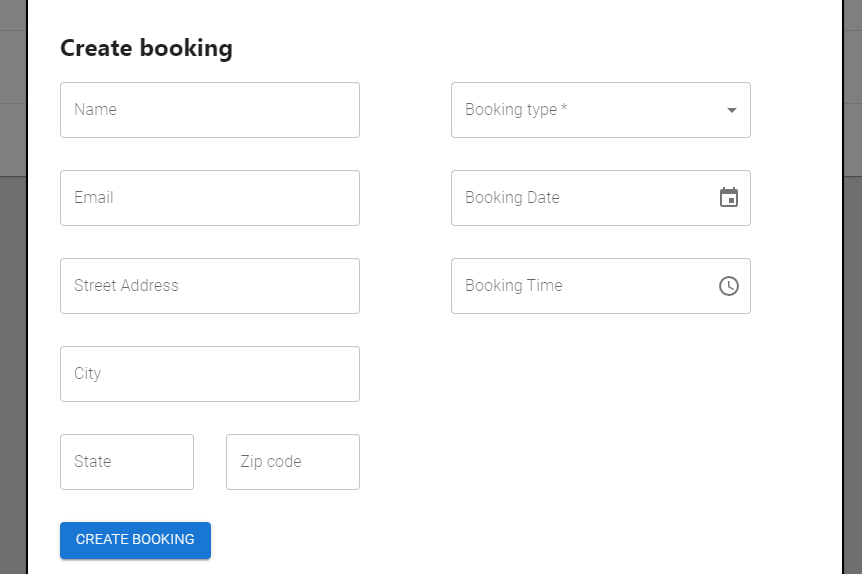

<!-- PROJECT INTRODUCTION -->
<br />
<p align="center">
  <h3 align="center">Booking Application</h3>

  <p align="center">
    A fullstack booking application with form field validation utilizing Material UI and Formik.
    <br />
  </p>
</p>

[](https://opensource.org/licenses/MIT)

<!-- ABOUT THE PROJECT -->
## About The Project


Project Link: [Booking](https://serene-inlet-73438.herokuapp.com/)

### Built With


<!-- GETTING STARTED -->
## Getting Started

To get a local copy up and running follow these simple steps.

### Installation

1. Clone the repo
   ```sh
   git clone https://github.com/Fikcup/booking-spruce.git
   ```
2. Install Dependencies
    ```sh
    npm install
    cd client
    npm install
    cd ../server
    npm install
    ```
3. Add a .env file in the server folder with your database name, host, and password.
4. Execute the schema file in MySQL workbench or MySQL shell
5. Run the application
    ```sh
    npm run dev
    ```

<!-- LICENSE -->
## License
MIT License

Copyright (c) 2021 Rhys

Permission is hereby granted, free of charge, to any person obtaining a copy
of this software and associated documentation files (the "Software"), to deal
in the Software without restriction, including without limitation the rights
to use, copy, modify, merge, publish, distribute, sublicense, and/or sell
copies of the Software, and to permit persons to whom the Software is
furnished to do so, subject to the following conditions:

The above copyright notice and this permission notice shall be included in all
copies or substantial portions of the Software.

THE SOFTWARE IS PROVIDED "AS IS", WITHOUT WARRANTY OF ANY KIND, EXPRESS OR
IMPLIED, INCLUDING BUT NOT LIMITED TO THE WARRANTIES OF MERCHANTABILITY,
FITNESS FOR A PARTICULAR PURPOSE AND NONINFRINGEMENT. IN NO EVENT SHALL THE
AUTHORS OR COPYRIGHT HOLDERS BE LIABLE FOR ANY CLAIM, DAMAGES OR OTHER
LIABILITY, WHETHER IN AN ACTION OF CONTRACT, TORT OR OTHERWISE, ARISING FROM,
OUT OF OR IN CONNECTION WITH THE SOFTWARE OR THE USE OR OTHER DEALINGS IN THE
SOFTWARE.

<!-- CONTACT -->
## Contact

Rhys Wright - [LinkedIn](https://www.linkedin.com/in/rhys-wright/) - rhys.n.wright@gmail.com